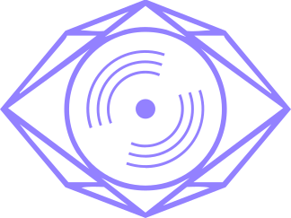
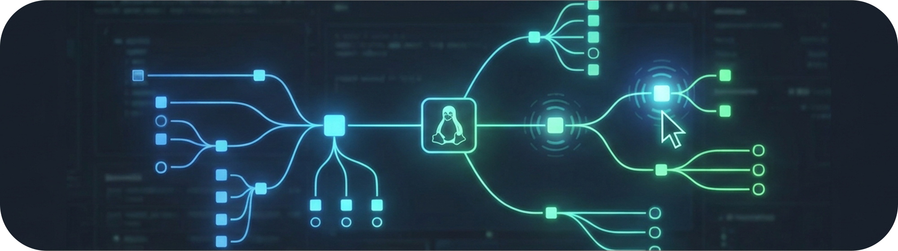
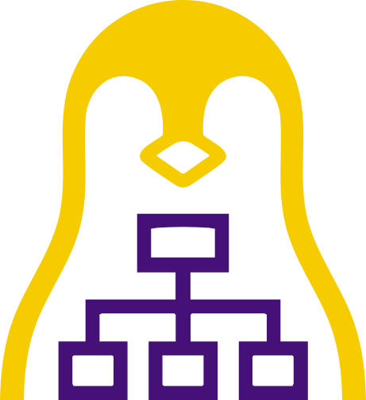
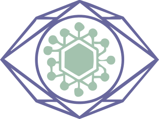
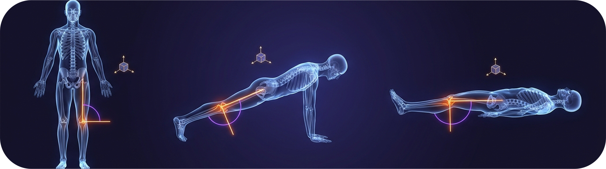
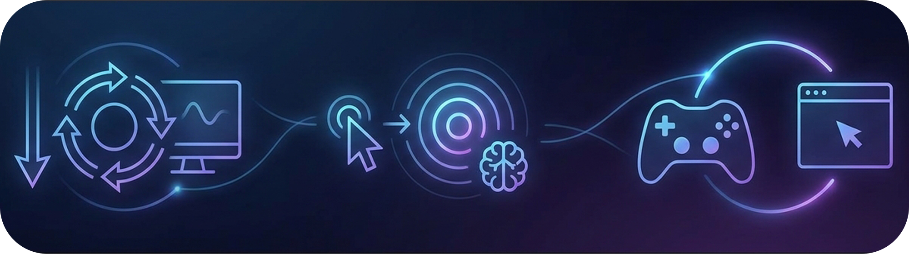
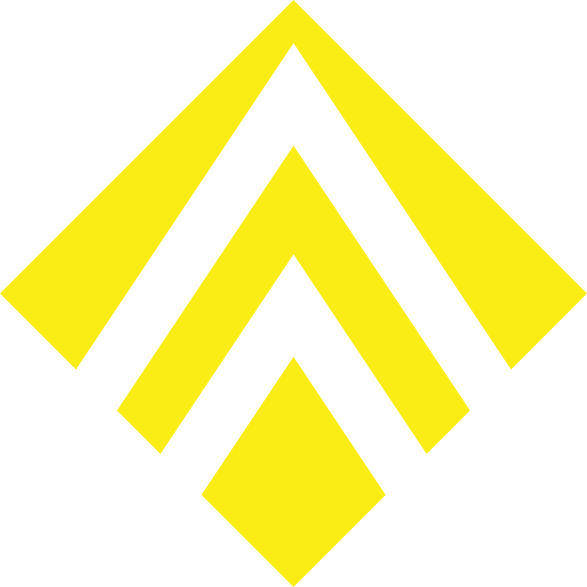

<div align="center">

<div align="center">


<br/>

<a href="https://git.io/typing-svg"></a>

🇱🇰 Sri Lanka &nbsp;·&nbsp; 💼 Open to Remote Opportunities

<br/>

[](https://www.linkedin.com/in/naveen-akalanka)
[](https://github.com/NaveenAkalanka)


</div>


## 👋 About Me

```yaml
version: '3.8'
services:
  naveen_akalanka:
    image: infra-engineer:latest
    environment:
      - FOCUS=Cloud, DevOps, Agentic Engineering
      - HOMELAB=Proxmox VE, TrueNAS, Docker, Linux VMs
      - DESIGN=Graphic Design, 3D Design
    ports:
      - "80:Idea"
      - "443:Reality"
    volumes:
      - /brain/knowledge:/app/skills
```

I'm an infrastructure engineer who started in networking and never stopped going deeper. I run a self-hosted home lab — not as a hobby, but as a real environment where I design, break, and fix systems. When existing tooling doesn't solve the problem, I build the tool myself.

I'm currently evolving from a solid network/Linux foundation into **Cloud (Azure & AWS), Infrastructure as Code, and DevOps automation** — while keeping the low-level systems understanding that most cloud engineers skip. My design background means the tools I ship aren't just functional — they're polished.

> [!NOTE]
> 🔭 &nbsp;**Currently leveling up:** Cloud (Azure & AWS) · Kubernetes · Ansible · IaC  
> 💬 &nbsp;**Ask me about:** Proxmox · Docker · Network Design · Linux · Self-Hosting · Agentic Engineering  


## 🛠️ Tech Stack

**⚙️ &nbsp;Infrastructure & Virtualization**


**☁️ &nbsp;Cloud & DevOps**


**🌐 &nbsp;Networking & Security**


**💻 &nbsp;Dev & Tooling**


**🎨 &nbsp;Design**


## 🚀 Featured Projects

<table>
<tr>
<td width="50%" valign="top">

<a href="https://github.com/NaveenAkalanka/ScanEye"></a>

###  &nbsp;[ScanEye](https://github.com/NaveenAkalanka/ScanEye)
**Advanced Network Scanning & Monitoring Tool**

Web browsers can't touch your local network — so I built a bridge. ScanEye runs as a privileged Docker container (`network_mode: host`), uses Nmap for deep device discovery, and streams live results to a React dashboard via WebSockets. Rate-limited, Helmet-hardened, injection-resistant.

`Docker` `Node.js` `React` `Nmap` `WebSockets` `Express`

</td>
<td width="50%" valign="top">

<a href="https://github.com/NaveenAkalanka/NuxView"></a>

###  &nbsp;[NuxView](https://github.com/NaveenAkalanka/NuxView)
**Interactive Linux Directory Visualization Tool**

`ls -la` shows you names. NuxView shows you *meaning*. Scans local filesystems and renders an interactive, node-based web UI where you can explore directory roles — not just paths. Built for learning environments and complex lab setups alike.

`TypeScript` `Node.js` `React` `Linux` `File System API`

</td>
</tr>
<tr>
<td width="50%" valign="top">

<a href="https://github.com/NaveenAkalanka/ClusterEye"></a>

###  &nbsp;[ClusterEye](https://github.com/NaveenAkalanka/ClusterEye)
**Advanced Cluster Monitoring & Management Dashboard**

Real-time monitoring for cluster environments. The architectural predecessor to ScanEye — and the project that exposed the browser sandboxing problem I later solved with a containerized split-architecture approach.

`JavaScript` `Node.js` `Docker`

</td>
<td width="50%" valign="top">

<a href="https://github.com/NaveenAkalanka/PoseFit-V2"></a>

###  &nbsp;[PoseFit V2](https://github.com/NaveenAkalanka/PoseFit-V2)
**Body-Orientation-Invariant 3D Joint-Angle Estimation**

Biomechanical angle estimation that stays accurate regardless of camera viewpoint, distance, or body rotation. Goes well beyond standard pose detection — this one maintains constant angle values even as the user moves freely.

`JavaScript` `Machine Learning` `Computer Vision`

</td>
</tr>
<tr>
<td width="50%" valign="top">

<a href="https://github.com/NaveenAkalanka/ScrollSync"></a>

###  &nbsp;[ScrollSync](https://github.com/NaveenAkalanka/ScrollSync)
**Hands-Free Chrome Browsing Extension**

Auto-scroll, smart click navigation, and gamepad controller support for Chrome. Built to solve a real accessibility and workflow convenience problem — because sometimes your hands should be free.

`JavaScript` `Chrome Extension API`

</td>
<td width="50%" valign="top">

<a href="https://github.com/NaveenAkalanka/SerenityEcho"></a>

###  &nbsp;[SerenityEcho](https://github.com/NaveenAkalanka/SerenityEcho)
**Privacy-First Offline Ambient Sound Mixer**

No signups. No paywalls. No cloud. A fully offline-capable ambient sound mixer — because not every tool needs to phone home. Works entirely in the browser, no data leaves your device.

`TypeScript` `PWA` `Web Audio API`

</td>
</tr>
</table>

<details>
<summary><b>📦 More Projects</b></summary>

<br/>

| Project | Description | Stack |
|---------|-------------|-------|
| [DesignFlow](https://github.com/NaveenAkalanka/DesignFlow) | Internal web app to streamline outlet design tracking & artwork approvals — replaces a legacy system with a proper UI | `JavaScript` |
| [MFTrack](https://github.com/NaveenAkalanka/MFTrack) | Personal finance tracker — clean, fast, self-hosted | `React` `Vite` `Tailwind` |
| [KokoMate](https://github.com/NaveenAkalanka/KokoMate) | Installment & merchant fee calculator | `TypeScript` |
| [DailyBurn](https://github.com/NaveenAkalanka/DailyBurn) | Daily tracking utility | `JavaScript` |
| [PoseFit](https://github.com/NaveenAkalanka/PoseFit) | Real-time ML application for home exercise posture correction | `JavaScript` |

</details>


## 📈 GitHub Activity & Stats

<div align="center">


<br/><br/>


<table>
<tr>
<td width="50%" align="center">

</td>
<td width="50%" align="center">

</td>
</tr>
</table>


</div>


## 🎓 Education & Recognition

```
🎓  BSc (Hons) Computer Networks — University of Wolverhampton
    ├── First Class Honours
    ├── 🏆 Best Dissertation / Research Project Award · Oct 2025
    └── Feb 2024 – Oct 2024

🎓  HND Computing (Networking & Telecommunications) — Pearson Education
    ├── Distinction
    └── Oct 2021 – Aug 2023

💼  System Administrator — JID Advertising Agency
    ├── Network Troubleshooting · System Administration · Infrastructure
    └── Sep 2021 – Present · 4+ years
```


## 🤖 On Agentic Engineering

> [!NOTE]  
> **My AI Philosophy**  
> I use AI as a force multiplier for my workflow, not as a replacement for engineering. The systems design, architecture, and problem-solving are strictly my domain. I use AI agents to rapidly translate my ideas into reality and accelerate execution. 

By combining deep infrastructure knowledge with **Agentic Engineering**, I can explore multiple technical paths and approaches in a fraction of the time, evolving into a more comprehensive and effective engineer. I use this methodology to solve real, complex infrastructure problems I face on the job.


## 🐍 Contribution Activity

<div align="center">
<picture>
  <source media="(prefers-color-scheme: dark)" srcset="https://raw.githubusercontent.com/NaveenAkalanka/NaveenAkalanka/output/github-contribution-grid-snake-dark.svg" />
  <source media="(prefers-color-scheme: light)" srcset="https://raw.githubusercontent.com/NaveenAkalanka/NaveenAkalanka/output/github-contribution-grid-snake.svg" />
  
</picture>
</div>


<div align="center">

**I build things. I document them. I share them.**  
**Let's connect.**

<br/>

[](https://www.linkedin.com/in/naveen-akalanka)

<br/>

<sub>⚡ Self-hosted · Open source · Always building</sub>

<br/>


</div>
