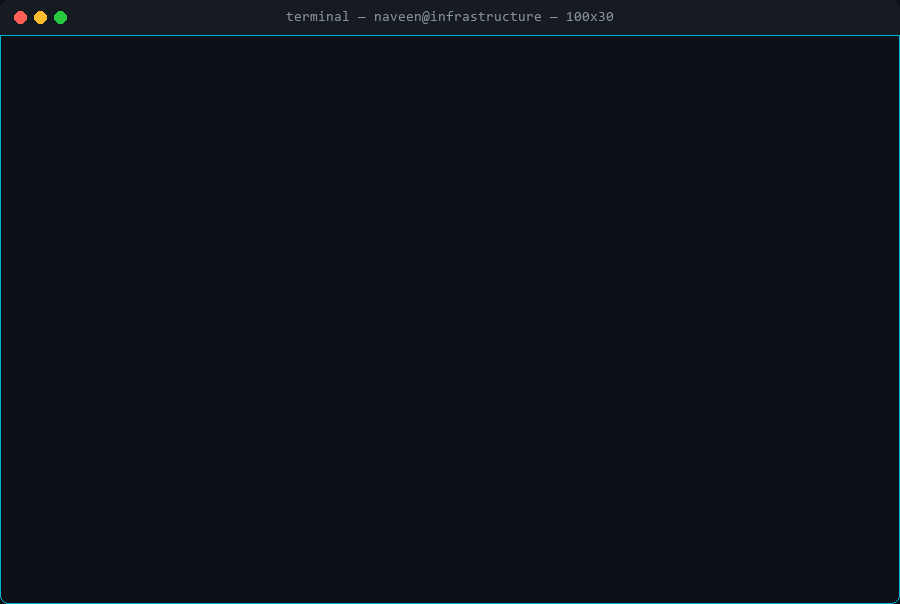
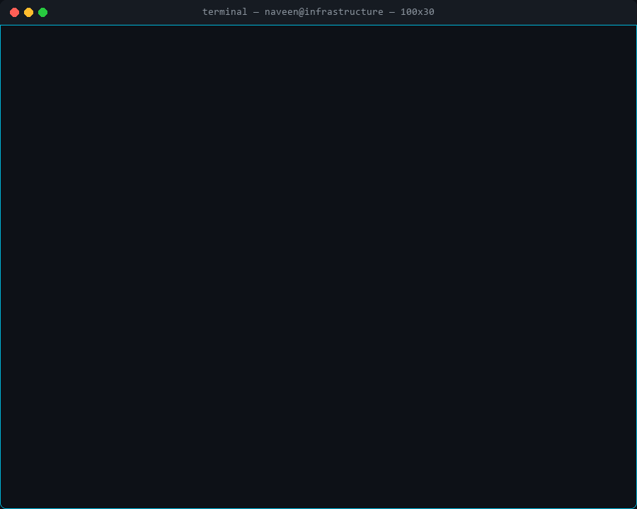
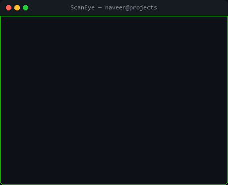
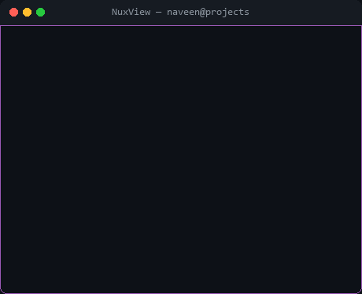
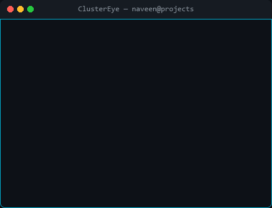
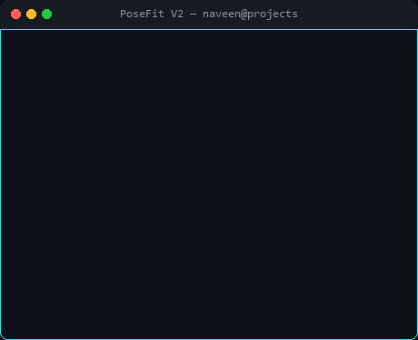
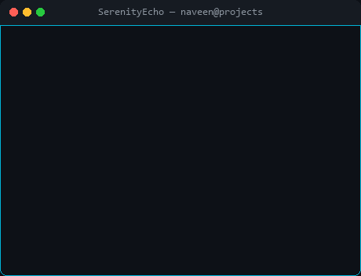
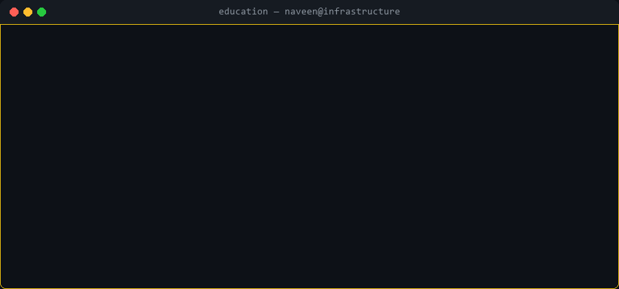
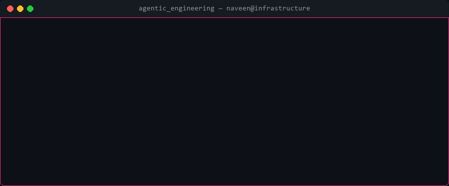

##  About Me

##  Tech Stack

** &nbsp;Infrastructure & Virtualization**

** &nbsp;Cloud & DevOps**

** &nbsp;Networking & Security**

** &nbsp;Dev & Tooling**

** &nbsp;Design**

##  Featured Projects

<table>
<tr>
<td width="50%" valign="top">

###  &nbsp;[ScanEye](https://github.com/NaveenAkalanka/ScanEye)

</td>
<td width="50%" valign="top">

###  &nbsp;[NuxView](https://github.com/NaveenAkalanka/NuxView)

</td>
</tr>
<tr>
<td width="50%" valign="top">

###  &nbsp;[ClusterEye](https://github.com/NaveenAkalanka/ClusterEye)

</td>
<td width="50%" valign="top">

###  &nbsp;[PoseFit V2](https://github.com/NaveenAkalanka/PoseFit-V2)

</td>
</tr>
<tr>
<td width="50%" valign="top">

###  &nbsp;[ScrollSync](https://github.com/NaveenAkalanka/ScrollSync)

</td>
<td width="50%" valign="top">

###  &nbsp;[SerenityEcho](https://github.com/NaveenAkalanka/SerenityEcho)

</td>
</tr>
</table>

<b> More Projects</b>

 

| Project | Description | Stack |
|---------|-------------|-------|
| [DesignFlow](https://github.com/NaveenAkalanka/DesignFlow) | Internal web app to streamline outlet design tracking & artwork approvals — replaces a legacy system with a proper UI | `JavaScript` |
| [MFTrack](https://github.com/NaveenAkalanka/MFTrack) | Personal finance tracker — clean, fast, self-hosted | `React` `Vite` `Tailwind` |
| [KokoMate](https://github.com/NaveenAkalanka/KokoMate) | Installment & merchant fee calculator | `TypeScript` |
| [DailyBurn](https://github.com/NaveenAkalanka/DailyBurn) | Daily tracking utility | `JavaScript` |
| [PoseFit](https://github.com/NaveenAkalanka/PoseFit) | Real-time ML application for home exercise posture correction | `JavaScript` |

##  GitHub Activity & Stats

  

<table>
<tr>
<td width="50%" align="center">

</td>
<td width="50%" align="center">

</td>
</tr>
</table>

##  Education & Recognition

##  On Agentic Engineering

##  Contribution Activity

<picture>
  <source media="(prefers-color-scheme: dark)" srcset="https://raw.githubusercontent.com/NaveenAkalanka/NaveenAkalanka/output/github-contribution-grid-snake-dark.svg" />
  <source media="(prefers-color-scheme: light)" srcset="https://raw.githubusercontent.com/NaveenAkalanka/NaveenAkalanka/output/github-contribution-grid-snake.svg" />
  
</picture>

**I build things. I document them. I share them.**  
**Let's connect.**

 

 

⚡ Self-hosted · Open source · Always building

 

