<picture>
  <source media="(max-width: 600px) and (prefers-reduced-motion: reduce)" srcset="./Assets/neon-studio/hero-mobile-v1-still.png">
  <source media="(prefers-reduced-motion: reduce)" srcset="./Assets/neon-studio/hero-v1-still.png">
  <source media="(max-width: 600px)" srcset="./Assets/neon-studio/hero-mobile-v1.gif">
  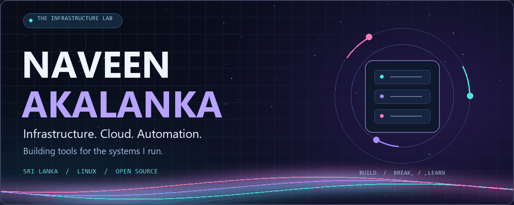
</picture>

  <b>Infrastructure engineer · Linux & networking · Cloud & DevOps · Agentic engineering</b>

  
  &nbsp;
  

## A little about me

I’m **Naveen**, an infrastructure engineer from **Sri Lanka**. I started in networking and kept going deeper into Linux, virtualization, and self-hosted systems. My focus now spans **Azure, AWS, infrastructure as code, and automation**.

My Proxmox home lab is where I test ideas, break things, and learn how to make them resilient. When the right tool doesn’t exist, I build it. A background in graphic and 3D design shapes how those tools look and feel, too.

## Things I’ve built

A mix of infrastructure tools, visual experiments, and everyday problems turned into software.

<table>
<tr>
<td width="50%" valign="top">

###  [ScanEye](https://github.com/NaveenAkalanka/ScanEye)

**Your network, brought into view.**

Nmap discovery in Docker, with live results streamed to a browser dashboard.

`Docker` `Nmap` `React` `WebSockets`

[Explore the project →](https://github.com/NaveenAkalanka/ScanEye)

</td>
<td width="50%" valign="top">

<a href="https://github.com/NaveenAkalanka/NuxView">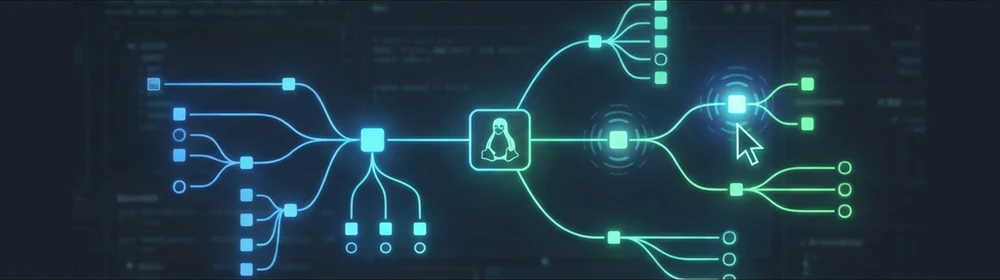</a>

###  [NuxView](https://github.com/NaveenAkalanka/NuxView)

**Find your way around Linux.**

Explore local directories through an interactive visual web interface.

`TypeScript` `Node.js` `React` `Linux`

[Explore the project →](https://github.com/NaveenAkalanka/NuxView)

</td>
</tr>
<tr>
<td width="50%" valign="top">

<a href="https://github.com/NaveenAkalanka/ClusterEye">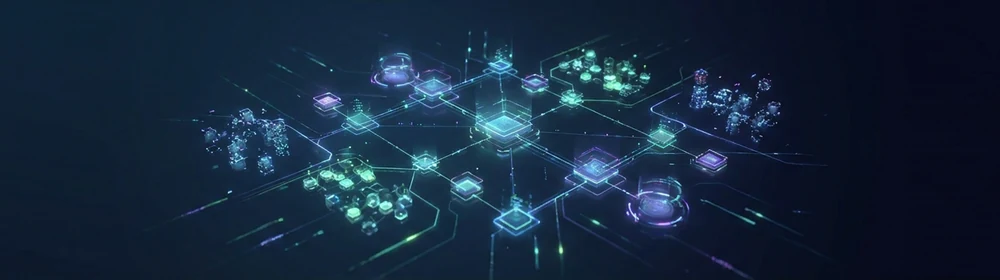</a>

###  [ClusterEye](https://github.com/NaveenAkalanka/ClusterEye)

**A closer look at your cluster.**

A monitoring and management dashboard that helped shape my approach to ScanEye.

`JavaScript` `Node.js` `Docker`

[Explore the project →](https://github.com/NaveenAkalanka/ClusterEye)

</td>
<td width="50%" valign="top">

<a href="https://github.com/NaveenAkalanka/PoseFit-V2">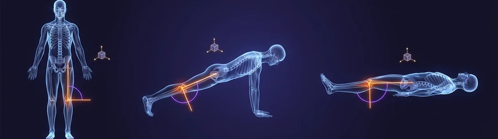</a>

###  [PoseFit V2](https://github.com/NaveenAkalanka/PoseFit-V2)

**Movement, from a different angle.**

Body-orientation-invariant 3D joint-angle estimation for biomechanics and computer vision.

`JavaScript` `ML` `Computer vision`

[Explore the project →](https://github.com/NaveenAkalanka/PoseFit-V2)

</td>
</tr>
<tr>
<td width="50%" valign="top">

<a href="https://github.com/NaveenAkalanka/ScrollSync">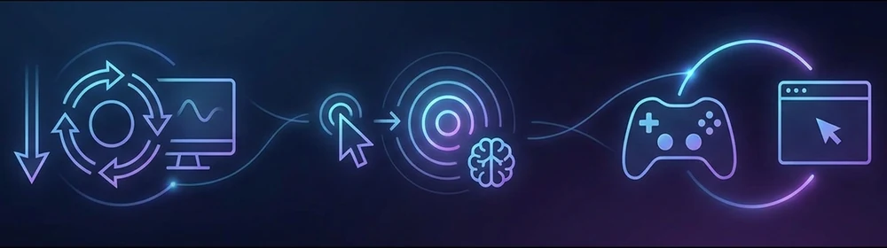</a>

### 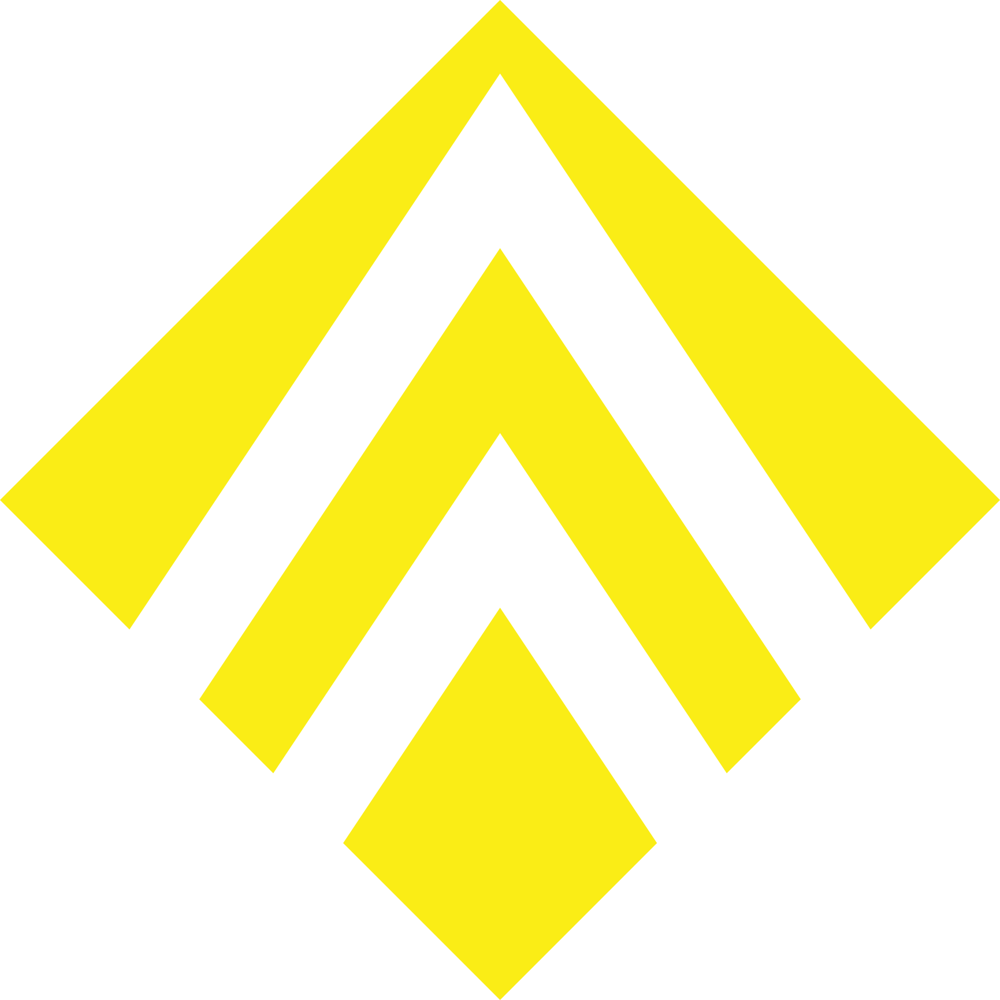 [ScrollSync](https://github.com/NaveenAkalanka/ScrollSync)

**Give your hands a break.**

Auto-scroll, smart clicks, and gamepad control for hands-free Chrome browsing.

`JavaScript` `Chrome extension`

[Explore the project →](https://github.com/NaveenAkalanka/ScrollSync)

</td>
<td width="50%" valign="top">

<a href="https://github.com/NaveenAkalanka/SerenityEcho">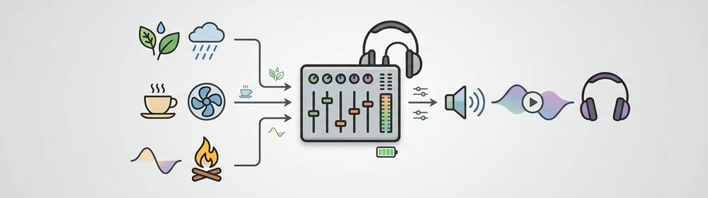</a>

### 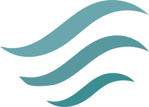 [SerenityEcho](https://github.com/NaveenAkalanka/SerenityEcho)

**A little space to focus.**

A privacy-focused, offline ambient sound mixer. No signups, no cloud dependency.

`TypeScript` `PWA` `Web Audio`

[Explore the project →](https://github.com/NaveenAkalanka/SerenityEcho)

</td>
</tr>
</table>

<b>More from the workshop</b>

| Project | What it does |
| :--- | :--- |
| [DesignFlow](https://github.com/NaveenAkalanka/DesignFlow) | Outlet design tracking and artwork approvals. |
| [MFTrack](https://github.com/NaveenAkalanka/MFTrack) | A personal finance tracker with React, Vite, and Tailwind. |
| [KokoMate](https://github.com/NaveenAkalanka/KokoMate) | Installment and merchant-fee calculations. |
| [DailyBurn](https://github.com/NaveenAkalanka/DailyBurn) | A daily tracking utility. |
| [PoseFit](https://github.com/NaveenAkalanka/PoseFit) | My original vision-based exercise posture-correction project. |

## My toolkit

<picture>
  <source media="(max-width: 600px)" srcset="./Assets/neon-studio/stack-mobile.svg">
  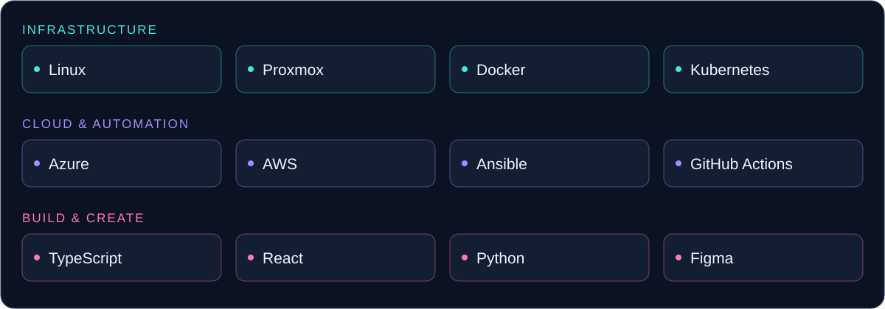
</picture>

**Also in the mix:** LXC · Minikube · TrueNAS · ZFS · Cloudflare · Traefik · n8n · Cisco · Wireshark · JavaScript · Node.js · Graphic & 3D design

## Inside the home lab

My high-availability **Proxmox lab** is a place to explore systems, test failure modes, and automate the repeatable work.

<picture>
  <source media="(max-width: 600px)" srcset="./Assets/neon-studio/lab-mobile.svg">
  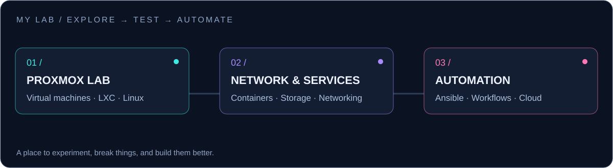
</picture>

The same curiosity carries into my cloud work: understand the network, know what runs underneath, and document what you learn.

## A little activity, in motion

<picture>
  <source media="(prefers-color-scheme: dark)" srcset="https://raw.githubusercontent.com/NaveenAkalanka/NaveenAkalanka/output/github-contribution-grid-snake-dark.svg">
  <source media="(prefers-color-scheme: light)" srcset="https://raw.githubusercontent.com/NaveenAkalanka/NaveenAkalanka/output/github-contribution-grid-snake.svg">
  
</picture>

Generated from my GitHub contributions by this repository’s scheduled workflow.

## Education & recognition

**🎓 BSc (Hons) Computer Networks** · University of Wolverhampton 
First Class Honours · 2024

**🏆 Highest Academic Achievement (Batch Top)** and **Best Dissertation / Research Project** awards · October 2025

**🎓 HND Computing — Networking & Telecommunications** · Pearson 
Distinction · 2021–2023

## Building with AI

I use AI agents to explore approaches, speed up implementation, and solve problems I encounter in my work. I own the architecture, review the output, and validate the result.

  <b>Into infrastructure, automation, or building useful things?</b> 
  <a href="https://www.linkedin.com/in/naveen-akalanka">Let’s connect on LinkedIn ↗</a>

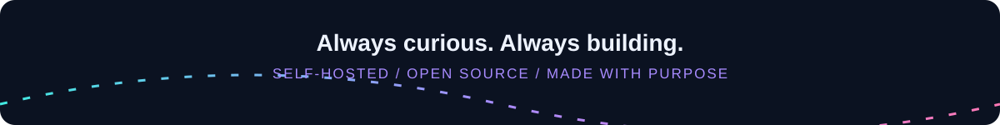
