<picture>
  <source media="(max-width: 600px) and (prefers-reduced-motion: reduce)" srcset="./Assets/operations/hero-mobile-still.svg">
  <source media="(prefers-reduced-motion: reduce)" srcset="./Assets/operations/hero-still.svg">
  <source media="(max-width: 600px)" srcset="./Assets/operations/hero-mobile.svg">
  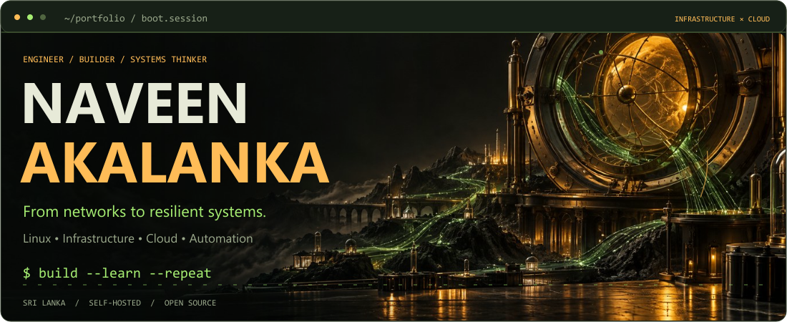
</picture>

  <a href="#operator">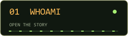</a>
  <a href="#projects">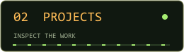</a>
  <a href="#lab">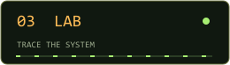</a>
  <a href="#activity">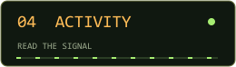</a>

<b>Infrastructure engineer · Sri Lanka · Linux & networking · Cloud & DevOps</b> 
A story told through systems, experiments, and the tools I build.

## Operator

<picture>
  <source media="(prefers-reduced-motion: reduce)" srcset="./Assets/operations/chapter-01-still.svg">
  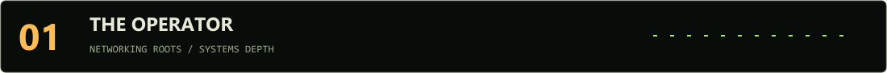
</picture>

<picture>
  <source media="(max-width: 600px) and (prefers-reduced-motion: reduce)" srcset="./Assets/operations/identity-mobile-still.svg">
  <source media="(prefers-reduced-motion: reduce)" srcset="./Assets/operations/identity-still.svg">
  <source media="(max-width: 600px)" srcset="./Assets/operations/identity-mobile.svg">
  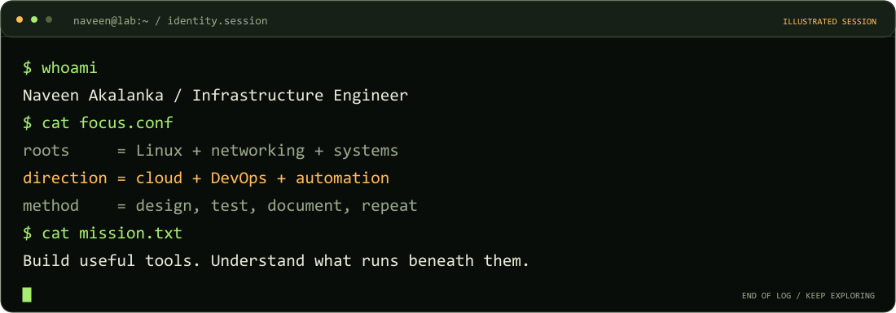
</picture>

<kbd>OPEN</kbd> <b>The story behind the prompt</b>

I started in networking and kept going deeper into Linux, virtualization, and self-hosted systems. My focus is on **cloud, DevOps, infrastructure as code, and automation**, grounded in understanding how the underlying systems work.

I use my Proxmox lab to test ideas, troubleshoot failures, and document what I learn. When existing tools don’t solve a problem, I build one. My background in graphic and 3D design shapes how those tools communicate.

## Projects

<picture>
  <source media="(prefers-reduced-motion: reduce)" srcset="./Assets/operations/chapter-02-still.svg">
  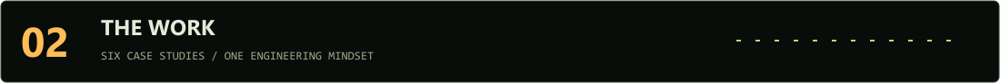
</picture>

These are the steps in my engineering story: **discover → observe → understand → package → protect → operate**. The first five are public software projects; the sixth is my infrastructure lab.

### 01 / Discover the network

<a href="https://github.com/NaveenAkalanka/ScanEye">
<picture>
  <source media="(prefers-reduced-motion: reduce)" srcset="./Assets/operations/project-scaneye-still.svg">
  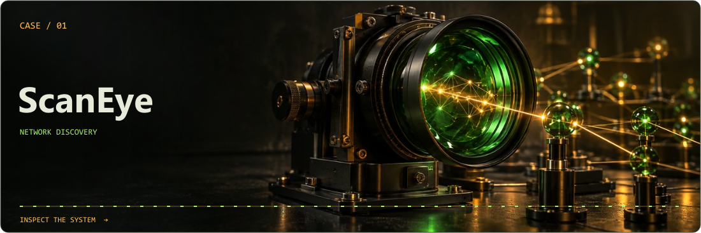
</picture>
</a>

A browser can’t scan your local network. I built the bridge: **Nmap discovery inside Docker**, with results streamed to a React dashboard over WebSockets.

Docker · Nmap · Node.js · React · WebSockets

<kbd>INSPECT</kbd> <b>The engineering idea</b>

<picture>
  <source media="(max-width: 600px) and (prefers-reduced-motion: reduce)" srcset="./Assets/operations/case-scaneye-mobile-still.svg">
  <source media="(prefers-reduced-motion: reduce)" srcset="./Assets/operations/case-scaneye-still.svg">
  <source media="(max-width: 600px)" srcset="./Assets/operations/case-scaneye-mobile.svg">
  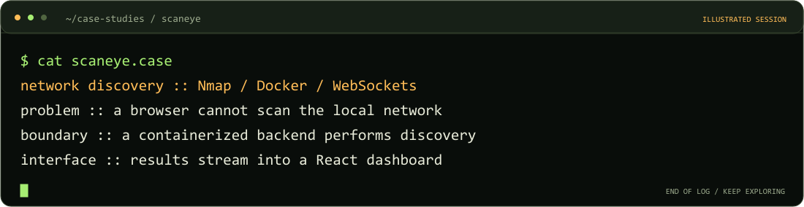
</picture>

A browser stays inside its security boundary. The backend performs the network discovery and sends results to the interface. This separation is the core architectural decision.

<a href="https://github.com/NaveenAkalanka/ScanEye">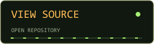</a>

### 02 / See the system

<a href="https://github.com/NaveenAkalanka/ClusterEye">
<picture>
  <source media="(prefers-reduced-motion: reduce)" srcset="./Assets/operations/project-clustereye-still.svg">
  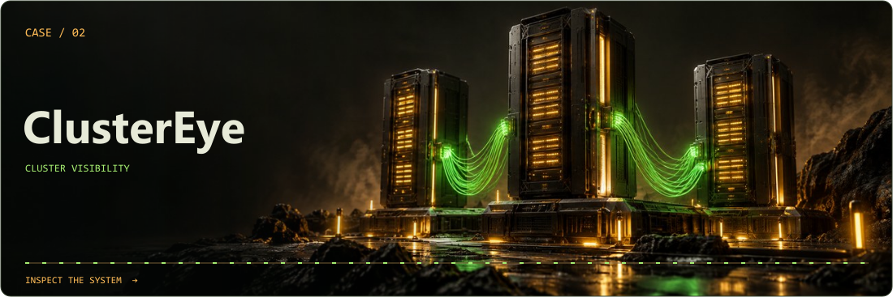
</picture>
</a>

Monitoring becomes useful when it gives you a view across the system. **ClusterEye brings cluster monitoring and management into one dashboard**, and helped shape the architecture I later explored in ScanEye.

JavaScript · Node.js · Docker

<kbd>INSPECT</kbd> <b>What this project taught me</b>

<picture>
  <source media="(max-width: 600px) and (prefers-reduced-motion: reduce)" srcset="./Assets/operations/case-clustereye-mobile-still.svg">
  <source media="(prefers-reduced-motion: reduce)" srcset="./Assets/operations/case-clustereye-still.svg">
  <source media="(max-width: 600px)" srcset="./Assets/operations/case-clustereye-mobile.svg">
  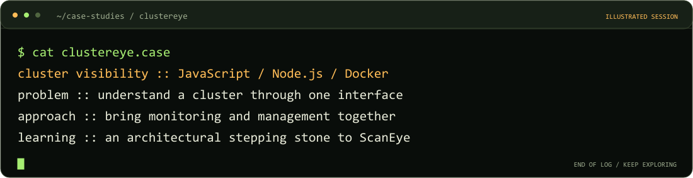
</picture>

Visibility is a systems problem as much as a UI problem. ClusterEye was an earlier step in exploring how an interface communicates with the infrastructure it represents.

### 03 / Understand the foundation

<a href="https://github.com/NaveenAkalanka/NuxView">
<picture>
  <source media="(prefers-reduced-motion: reduce)" srcset="./Assets/operations/project-nuxview-still.svg">
  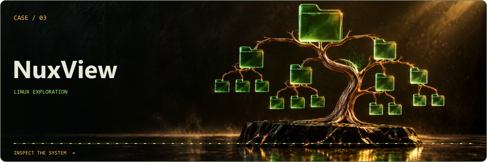
</picture>
</a>

Services sit on top of filesystems. **NuxView turns Linux directory structure into something you can explore visually**, making the layers underneath an application easier to understand.

Linux · TypeScript · Node.js · React

<kbd>INSPECT</kbd> <b>Why it belongs in my toolkit</b>

<picture>
  <source media="(max-width: 600px) and (prefers-reduced-motion: reduce)" srcset="./Assets/operations/case-nuxview-mobile-still.svg">
  <source media="(prefers-reduced-motion: reduce)" srcset="./Assets/operations/case-nuxview-still.svg">
  <source media="(max-width: 600px)" srcset="./Assets/operations/case-nuxview-mobile.svg">
  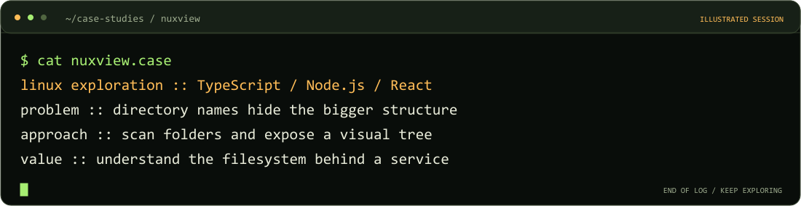
</picture>

Knowing what runs underneath a service starts with understanding its environment. NuxView scans local directories and exposes their structure through a web interface.

### 04 / Package a useful service

<a href="https://github.com/NaveenAkalanka/Savit">
<picture>
  <source media="(prefers-reduced-motion: reduce)" srcset="./Assets/operations/project-savit-still.svg">
  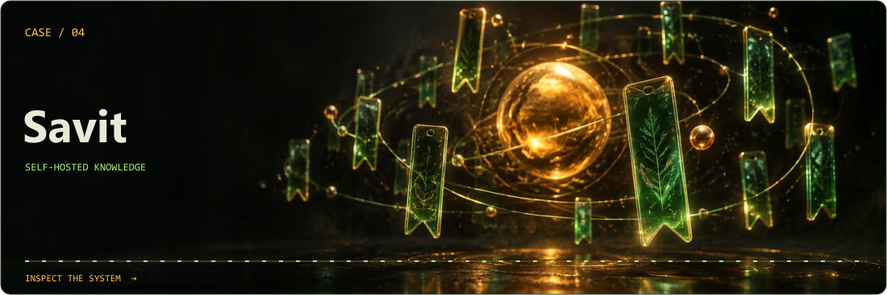
</picture>
</a>

A self-hosted home for saved links—with list, grid, and 3D constellation views. **Savit connects application design with containerized delivery**, explicit configuration, and a persistent database.

Docker · TypeScript · React · Fastify · libSQL/Turso

<kbd>INSPECT</kbd> <b>Inspect the deployment story</b>

<picture>
  <source media="(max-width: 600px) and (prefers-reduced-motion: reduce)" srcset="./Assets/operations/case-savit-mobile-still.svg">
  <source media="(prefers-reduced-motion: reduce)" srcset="./Assets/operations/case-savit-still.svg">
  <source media="(max-width: 600px)" srcset="./Assets/operations/case-savit-mobile.svg">
  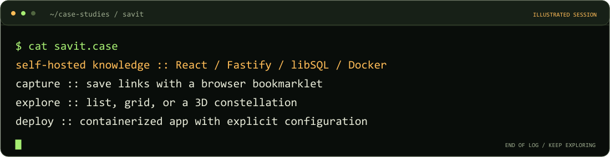
</picture>

A multi-stage Docker build packages the application. The container is stateless; saved data lives in libSQL/Turso. Database configuration is explicit, and TLS belongs at the reverse proxy. The 3D view uses three.js.

### 05 / Respect the workspace

<a href="https://github.com/NaveenAkalanka/lookmd">
<picture>
  <source media="(prefers-reduced-motion: reduce)" srcset="./Assets/operations/project-lookmd-still.svg">
  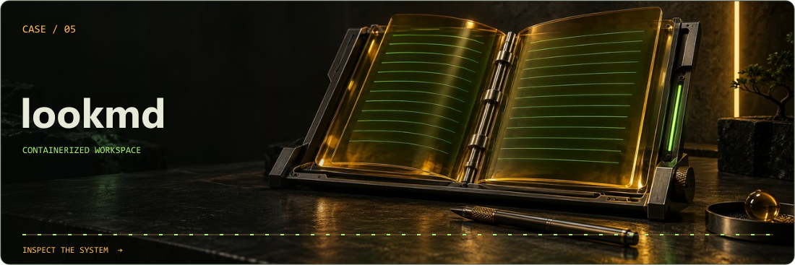
</picture>
</a>

A self-hosted Markdown reader and editor that treats a folder as a workspace. **lookmd combines a scoped filesystem API with a single-container deployment** and explicit, conflict-aware saves.

Docker · TypeScript · Fastify · React · CodeMirror

<kbd>INSPECT</kbd> <b>Inspect the engineering boundaries</b>

<picture>
  <source media="(max-width: 600px) and (prefers-reduced-motion: reduce)" srcset="./Assets/operations/case-lookmd-mobile-still.svg">
  <source media="(prefers-reduced-motion: reduce)" srcset="./Assets/operations/case-lookmd-still.svg">
  <source media="(max-width: 600px)" srcset="./Assets/operations/case-lookmd-mobile.svg">
  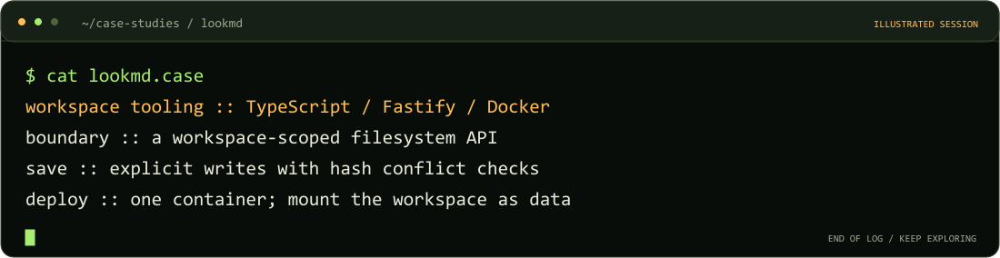
</picture>

The backend scopes file access to a workspace. Writes are explicit and hash-checked to detect changes on disk. A Docker image serves the client and API together, with the document folder mounted as data.

### 06 / Put the layers together

<a href="#lab">
<picture>
  <source media="(prefers-reduced-motion: reduce)" srcset="./Assets/operations/project-homelab-still.svg">
  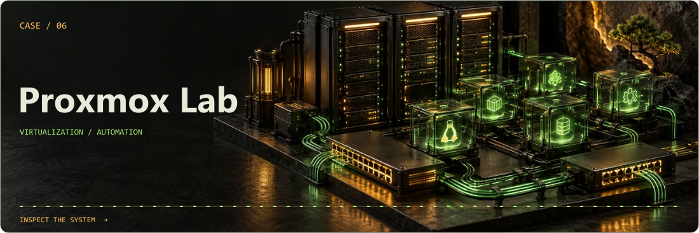
</picture>
</a>

My high-availability **Proxmox home lab** is where networking, Linux, virtual machines, containers, and automation meet. It is a working environment for experiments and troubleshooting.

Proxmox · Linux · VMs · LXC · Networking

<kbd>INSPECT</kbd> <b>Open the lab case study</b>

<picture>
  <source media="(max-width: 600px) and (prefers-reduced-motion: reduce)" srcset="./Assets/operations/case-homelab-mobile-still.svg">
  <source media="(prefers-reduced-motion: reduce)" srcset="./Assets/operations/case-homelab-still.svg">
  <source media="(max-width: 600px)" srcset="./Assets/operations/case-homelab-mobile.svg">
  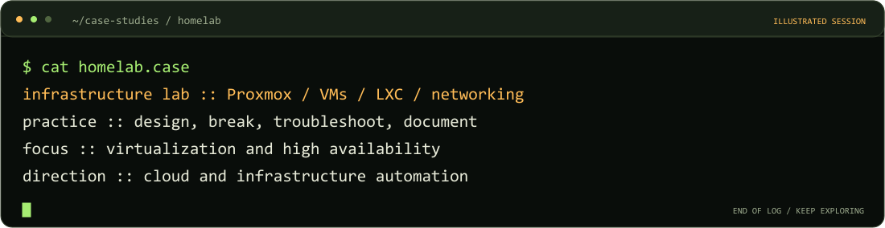
</picture>

This is my existing home-lab practice, not a separate software release. I use it to design, break, and harden systems, then carry those lessons into cloud and automation work.

<kbd>ARCHIVE</kbd> <b>Other experiments</b>

[PoseFit V2](https://github.com/NaveenAkalanka/PoseFit-V2) · [ScrollSync](https://github.com/NaveenAkalanka/ScrollSync) · [SerenityEcho](https://github.com/NaveenAkalanka/SerenityEcho) · [DesignFlow](https://github.com/NaveenAkalanka/DesignFlow) · [MFTrack](https://github.com/NaveenAkalanka/MFTrack) · [KokoMate](https://github.com/NaveenAkalanka/KokoMate) · [DailyBurn](https://github.com/NaveenAkalanka/DailyBurn) · [PoseFit](https://github.com/NaveenAkalanka/PoseFit)

## Lab

<picture>
  <source media="(prefers-reduced-motion: reduce)" srcset="./Assets/operations/chapter-03-still.svg">
  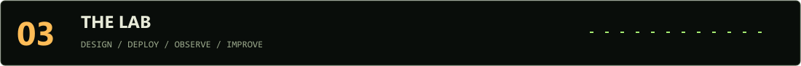
</picture>

<picture>
  <source media="(max-width: 600px) and (prefers-reduced-motion: reduce)" srcset="./Assets/operations/pipeline-mobile-still.svg">
  <source media="(prefers-reduced-motion: reduce)" srcset="./Assets/operations/pipeline-still.svg">
  <source media="(max-width: 600px)" srcset="./Assets/operations/pipeline-mobile.svg">
  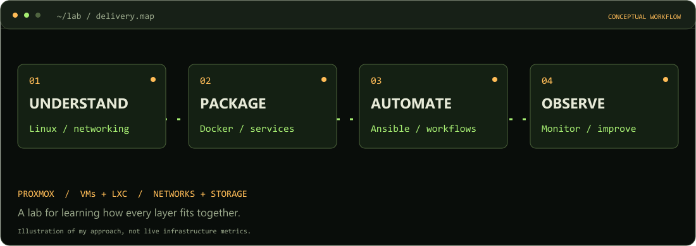
</picture>

<kbd>RUNBOOK</kbd> <b>Follow the delivery plan</b>

<picture>
  <source media="(max-width: 600px) and (prefers-reduced-motion: reduce)" srcset="./Assets/operations/deployment-mobile-still.svg">
  <source media="(prefers-reduced-motion: reduce)" srcset="./Assets/operations/deployment-still.svg">
  <source media="(max-width: 600px)" srcset="./Assets/operations/deployment-mobile.svg">
  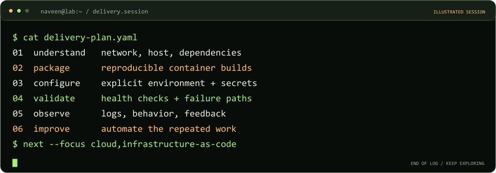
</picture>

<kbd>TOOLCHAIN</kbd> <b>Explore my infrastructure and cloud toolkit</b>

<picture>
  <source media="(max-width: 600px) and (prefers-reduced-motion: reduce)" srcset="./Assets/operations/skills-mobile-still.svg">
  <source media="(prefers-reduced-motion: reduce)" srcset="./Assets/operations/skills-still.svg">
  <source media="(max-width: 600px)" srcset="./Assets/operations/skills-mobile.svg">
  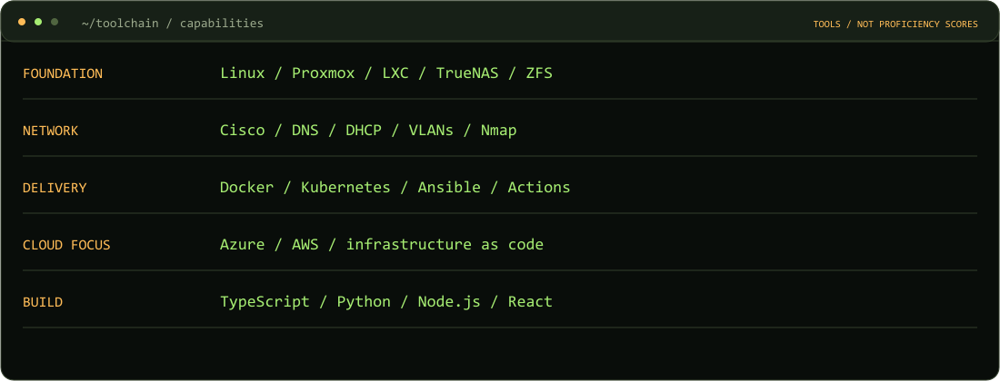
</picture>

Also in the mix: **Minikube · Cloudflare · Traefik · n8n · Wireshark**.

These are tools I work with and areas I’m developing—not proficiency scores or claims of production-scale deployments.

## Activity

<picture>
  <source media="(prefers-reduced-motion: reduce)" srcset="./Assets/operations/chapter-04-still.svg">
  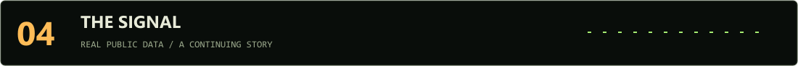
</picture>

<picture>
  <source media="(max-width: 600px) and (prefers-reduced-motion: reduce)" srcset="https://raw.githubusercontent.com/NaveenAkalanka/NaveenAkalanka/output/activity-mobile-still.svg">
  <source media="(prefers-reduced-motion: reduce)" srcset="https://raw.githubusercontent.com/NaveenAkalanka/NaveenAkalanka/output/activity-still.svg">
  <source media="(max-width: 600px)" srcset="https://raw.githubusercontent.com/NaveenAkalanka/NaveenAkalanka/output/activity-mobile.svg">
  
</picture>

Refreshed every 12 hours by this repository. The chart shows sampled public events—not total commits—and includes its last successful update time.

<kbd>PLAY</kbd> <b>Follow the contribution trail</b>

<picture>
  <source media="(prefers-color-scheme: dark)" srcset="https://raw.githubusercontent.com/NaveenAkalanka/NaveenAkalanka/output/github-contribution-grid-snake-dark.svg">
  
</picture>

## Next chapter

<picture>
  <source media="(prefers-reduced-motion: reduce)" srcset="./Assets/operations/chapter-05-still.svg">
  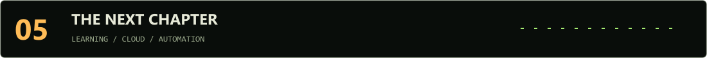
</picture>

<picture>
  <source media="(max-width: 600px) and (prefers-reduced-motion: reduce)" srcset="./Assets/operations/journey-mobile-still.svg">
  <source media="(prefers-reduced-motion: reduce)" srcset="./Assets/operations/journey-still.svg">
  <source media="(max-width: 600px)" srcset="./Assets/operations/journey-mobile.svg">
  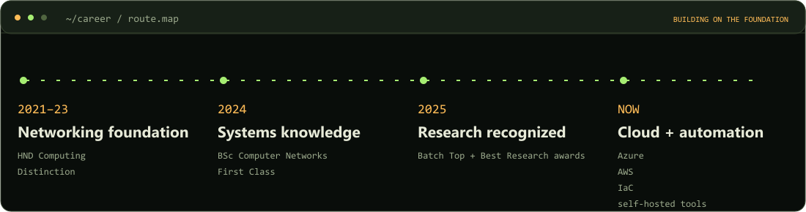
</picture>

<kbd>RECORD</kbd> <b>Education & recognition</b>

**BSc (Hons) Computer Networks** · University of Wolverhampton 
First Class Honours · 2024

**Highest Academic Achievement (Batch Top)** and **Best Dissertation / Research Project** awards · October 2025

**HND Computing — Networking & Telecommunications** · Pearson 
Distinction · 2021–2023

My next chapter builds on that foundation: **cloud infrastructure, repeatable delivery, and automation that solves real operational problems**. I use AI agents to accelerate exploration and implementation while owning the architecture, review, and validation.

  <b>Have a system worth understanding or a problem worth solving?</b>  
  <a href="https://www.linkedin.com/in/naveen-akalanka">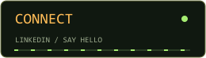</a>

naveen@lab:~$ <b>keep_building</b> ▋

