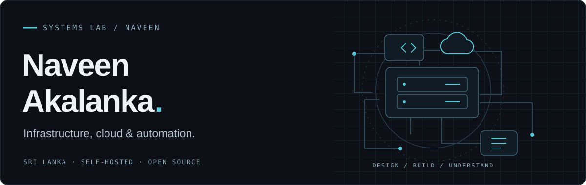
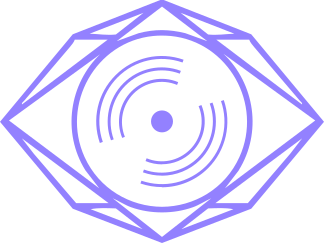
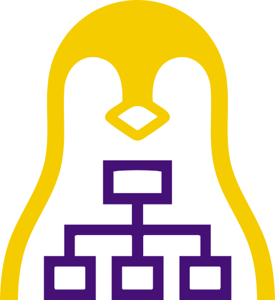
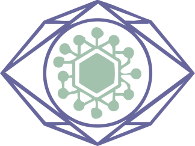
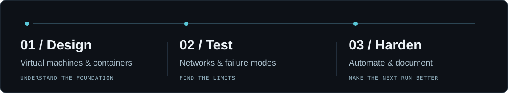

<picture>
  <source media="(max-width: 600px) and (prefers-color-scheme: dark)" srcset="./Assets/systems-lab/header-mobile-dark.svg">
  <source media="(max-width: 600px)" srcset="./Assets/systems-lab/header-mobile-light.svg">
  <source media="(prefers-color-scheme: dark)" srcset="./Assets/systems-lab/header-dark.svg">
  <source media="(prefers-color-scheme: light)" srcset="./Assets/systems-lab/header-light.svg">
  
</picture>

# I build tools for the systems I run.

I’m **Naveen Akalanka**, an infrastructure engineer based in Sri Lanka. I started in networking and kept going deeper into Linux, virtualization, and self-hosted systems. Today, I’m building toward cloud and DevOps, with a focus on Azure, AWS, infrastructure as code, and automation.

My home lab is where I test ideas, break things, and learn how to make them resilient. When the right tool doesn’t exist, I build it.

[Connect on LinkedIn](https://www.linkedin.com/in/naveen-akalanka) · [Explore my repositories](https://github.com/NaveenAkalanka?tab=repositories)

## Selected work

###  &nbsp; [ScanEye](https://github.com/NaveenAkalanka/ScanEye)

**A browser-based view into your local network.**

Browsers can’t directly scan a local network. ScanEye bridges that gap with a Docker-based backend, Nmap discovery, and live results streamed to a React dashboard over WebSockets.

`Docker` `Nmap` `Node.js` `React` `WebSockets`

[Explore ScanEye →](https://github.com/NaveenAkalanka/ScanEye)

---

###  &nbsp; [NuxView](https://github.com/NaveenAkalanka/NuxView)

**Make sense of the Linux filesystem.** An interactive directory viewer that scans local folders and turns their structure into a visual web interface for exploration and learning.

`TypeScript` `Node.js` `React` `Linux`

###  &nbsp; [ClusterEye](https://github.com/NaveenAkalanka/ClusterEye)

**See what’s happening across a cluster.** A monitoring and management dashboard, and the earlier project that led me toward ScanEye’s containerized approach.

`JavaScript` `Node.js` `Docker`

###  &nbsp; [PoseFit V2](https://github.com/NaveenAkalanka/PoseFit-V2)

**Explore movement beyond a fixed camera angle.** A framework for body-orientation-invariant 3D joint-angle estimation, built around biomechanics and computer vision.

`JavaScript` `Machine learning` `Computer vision`

<b>More things I’ve built</b>

| Project | What it does |
| :--- | :--- |
| [ScrollSync](https://github.com/NaveenAkalanka/ScrollSync) | Hands-free Chrome browsing with auto-scroll, smart clicks, and gamepad control. |
| [SerenityEcho](https://github.com/NaveenAkalanka/SerenityEcho) | An offline ambient sound mixer, built for privacy. |
| [DesignFlow](https://github.com/NaveenAkalanka/DesignFlow) | Outlet design tracking and artwork approvals for an internal workflow. |
| [MFTrack](https://github.com/NaveenAkalanka/MFTrack) | A personal finance tracker built with React, Vite, and Tailwind. |
| [KokoMate](https://github.com/NaveenAkalanka/KokoMate) | Installment and merchant-fee calculations. |
| [DailyBurn](https://github.com/NaveenAkalanka/DailyBurn) | A daily tracking utility. |
| [PoseFit](https://github.com/NaveenAkalanka/PoseFit) | The original vision-based exercise posture-correction project. |

## Inside my lab

My high-availability **Proxmox home lab** is a working environment for experimenting with infrastructure. I use it to explore virtualization, containers, networking, and the decisions that keep services running.

<picture>
  <source media="(max-width: 600px) and (prefers-color-scheme: dark)" srcset="./Assets/systems-lab/lab-mobile-dark.svg">
  <source media="(max-width: 600px)" srcset="./Assets/systems-lab/lab-mobile-light.svg">
  <source media="(prefers-color-scheme: dark)" srcset="./Assets/systems-lab/lab-dark.svg">
  <source media="(prefers-color-scheme: light)" srcset="./Assets/systems-lab/lab-light.svg">
  
</picture>

That hands-on work informs how I approach cloud infrastructure: understand the network, know the underlying system, automate repeatable work, and document what I learn.

## Tools I work with

| Area | Tools & technologies |
| :--- | :--- |
| **Infrastructure & networking** | Linux · Proxmox · LXC · TrueNAS · ZFS · Cisco · DNS / DHCP / VLANs · Nmap · Wireshark |
| **Cloud & automation** | Azure · AWS · Docker · Kubernetes · Minikube · Ansible · GitHub Actions · Cloudflare · Traefik · n8n |
| **Development & design** | JavaScript · TypeScript · Python · Node.js · React · WebSockets · Figma · Graphic & 3D design |

## Education & recognition

**BSc (Hons) Computer Networks** · University of Wolverhampton 
First Class Honours · 2024

Highest Academic Achievement (Batch Top) and Best Dissertation / Research Project awards · October 2025

**HND Computing — Networking & Telecommunications** · Pearson 
Distinction · 2021–2023

## How I build

I use AI agents to explore approaches, speed up implementation, and solve problems I encounter in my work. I own the architecture, review the output, and validate the result. My background in graphic and 3D design also shapes how I think about the tools people use.

---

**Building something around infrastructure, automation, or developer tools?** 
[Let’s connect on LinkedIn →](https://www.linkedin.com/in/naveen-akalanka)
